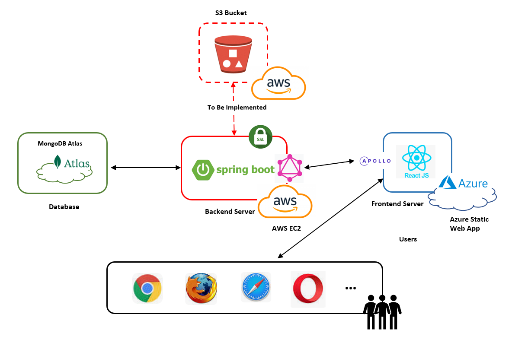

# Photo Sharing Website Backend
This project is for GNG5300 Individual Project Backend
# Tech Stack
**Database:** MongoDB, S3(TBD)\
**Framework:** Spring Boot \
**CI/CD**: Github Actions\
**Cloud Platform:** AWS EC2\
**API:** GraphQL\
*Notice: **SSL Certificate** is applied for secure https API url (disabled due to extra requirement for Chrome configuration)

# System Architecture


# API
Please check https://ec2-18-212-2-78.compute-1.amazonaws.com/graphiql 

Example query command:
```
query {
    allUsers {
        id
        username
        likedPhotos
    }
}
```

**All avialble APIs**:
```
type Query {
    allUsers: [User]
    allPhotos: [Photo]
    userByUsername(username: String!): User
    photoByTitle(title: String!): Photo
    login(username: String!, password: String!): User
}

type Mutation {
    addUser(username: String!, password: String!): User
    addPhoto(title: String!, description: String!, uploadedUser: String!, imgBase64: String!): Photo
    likePhoto(username: String!, photoTitle: String!): User
    unLikePhoto(username: String!, photoTitle: String!): User
    deletePhoto(username: String!, photoTitle: String!): Photo
}

type User {
    id: ID!
    username: String!
    photos: [String]
    likedPhotos: [String]
}

type Photo {
    id: ID!
    title: String!
    description: String
    uploadUser: String
    imgBase64: String
    likedUsers: [String]
}
```
# Database Schema
Collection Photo
```
[
   {
        id: ID!
        title: String!
        description: String
        uploadUser: String
        imgBase64: String
        likedUsers: [String]
   }
   ...
]
```
Collection User
```
[
   {
        id: ID!
        username: String!
        photos: [String]
        likedPhotos: [String]
   }
   ...
]
```
